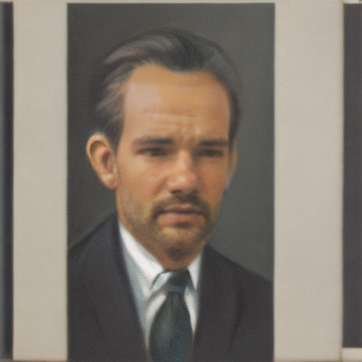

# 🧙‍♂️ Character generator
## Text Prompt + Face → Final Character Image 

This project generates a custom character image using a text description and swaps the face with a user-provided one (via URL or local file).
It combines tiny-sd (text-to-image) with InsightFace FaceSwap in a simple, unified pipeline.

### 📸 Example Pipeline Output

<p align="center">
  
  
  
</p>

<p align="center">
  <em>Left → SDXL Generated Image, Middle → Input Face, Right → Final FaceSwap Result</em>
</p>

### 🚀 Features
 - Generate a character image using a text prompt
 - Replace the face in the generated image with:
 - a face URL, or
 - a local face image
 - Single-file pipeline (predict.py)
 - Runs on CPU, CUDA, or MPS


### 📦 Installation
```
git clone https://github.com/stailend/character_generator.git
cd character-generator
pip install -r requirements.txt
```

**Run the Pipeline:**
```
python predict.py "<prompt text>" FACE_URL_OR_PATH
```

*Example:*
```
python predict.py "cyberpunk samurai woman, neon reflections" \
"https://example.com/my_face.jpg"
```
or

```
python predict.py "dark forest sorcerer with glowing symbols" \
"input_face.png"
```


### 🧠 Technologies Used

* SD (Tiny-SD)

Uses segmind/tiny-sd to generate high-quality character images from text.

* InsightFace FaceSwap

Uses inswapper_128.onnx for accurate and natural-looking face replacement.
